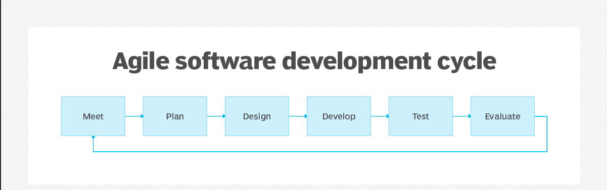
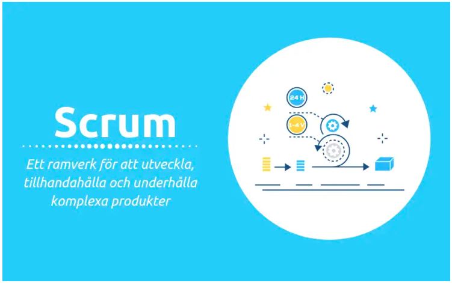
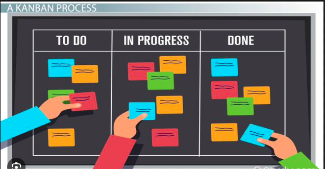
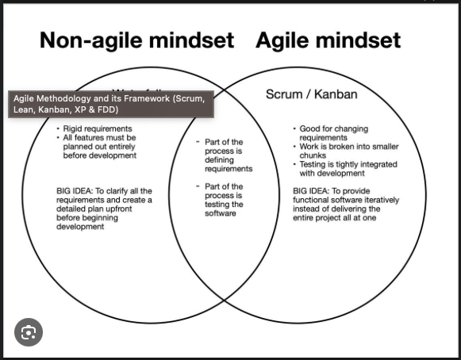

# Teorihandboken - Projektmetodik (PJ)
Studerande: 
# William Berhane 

Fullstack developer (FDW)

Inlämningdatum: 20231015

Chas Academy 

 

## Begrepp ord:
### Agila

 är en iterative metod för mjukvaruutveckling som hjälper utvecklare att skapa och leverera applikationer snabbare och mer effektivt.

### Entreprenörskap

är en person som vet hur man skapar kapital av en innovation eller lösning på ett problem.

### Extreme Programming 

är en metod och är om hur agile priciperna kan öka kundnöjdheten.

### Kanban 

är ett väldigt populärt ramverk för flexibel mjukvaruutveckling för en eller teammeddlemmar i de agila principerna.

### Metod

är ett sätt att arbete på för att skapa värden.

### Metodik

är ett sätt att arbeta på för att skapa ett eller flera värden.

### Scrum 

är en metod och är det vanligaste sättet att implementera de agila principerna.

### Webbutveckling

är processen att skapa och underhålla webbplatser och webbapplikationer.

 

## PJ 1.1 Agila metoder (Scrum, Kanban, Extreme Programming)

**Agile Methodology** är ett människofokuserat, resultatfokuserat tillvägagångssätt för mjukvaruutveckling som respekterar vår snabbt föränderliga värld. Det är centrerat kring adaptiv planering, självorganisering och korta leveranstider. Den är flexibel, snabb och syftar till ständiga kvalitetsförbättringar.  

***Exempel på agil metodik:***
De mest populära och vanliga exemplen är Scrum, Extreme Programming(XP), Feature Driven Development(FDD), Dynamic Systems Development(ASD), Crystal och Lean Software Development(LSD). Lag väljer vanligtvis en eller två metoder. De mest använda metoderna är Scrum och XP, som passar bra ihop.   
***Fördelar med agil metodik:***
Är direkt knutna till dess snabbare, lättare, mer engagerade tankesätt. Processen, i ett nötskal, levererar vad kunden vill ha,när kunden vill ha det. Det går åt mycket mindre tid för att utvecklas i fel riktning, och hela systemet är snabbare att reagera på förändringar.

## Scrum

***Scrum*** är ett lättviktigt agilt ramverk som kan användas av projektledare för att kontrollera alla typer av iterativa och inkrementella projekt. I scrum skapar produktägaren en produktbacklog som gör att de kan arbeta med sitt team för att identifiera och prioritera systemfunktionalitet. I detta inkluderar bug fixes, funktioner och icke-funktionella krav.

Det viktigaste roller som står bakom scrum koncept:
- Produkt ägare
- Scrum Master
- Sprint / Sprint planning
- Daily Scrum 
- Retrospective 
- Sprint backlog / user stories
- Product backlog

En produktägare gör en prioriterad önskelista känd som en produktbacklog. Scrum-teamet tar en liten bit av toppen av önskelistan som kallas en sprintbacklog och planerar att implementera den. Teamet slutför sin sprintbacklog-uppgift i en sprint(2-4 veckors). De bedömer framstegen i ett möte som kallas en daglig scrum. Scrum Master håller teamet fokuserat på målet. Vid sprintens slut är verket redo att skickas/visas.  Laget avslutar sprinten med en genomgång och startar sedan en ny sprint.

### Varför scrum? 

För att scrum erbjuda en minskad risk, snabbare time to market och en slutprodukt som är betydligt bättre anpassad till marknaden.

## Kanban 

***Kanban*** är ett väldigt populärt ramverk för flexibel software development. Alla delar av arbete som olika teammedlemmar hanterar representeras visuellt på en Kanban-tavla, vilket tillåter hela teamet att ständigt följa utvecklingen av hela projekt.

## Extreme Programming 

***Extremprogrammeringsmetoden (XP)*** är ett disciplinerat tillvägagångssätt som fokuserat på snabbhet och kontinuerlig leverans. Det framjar ökat kundengagemang, snabba återkopplingsslingor, kontinuerlig planering och testing och nära lagarbete. XP-metoden bygger på värderingarna kommunikation, feedback, enkelhet och mod. Kunder arbetar nära sitt utvecklingsteam för att definiera och prioritera sina efterfrågade användarberättelser. Det är dock upp till teamet att leverera de högsta prioriterade användarberättelserna i form av fungerande mjukvara som har testats vid varje iteration.

## PJ 1.2 Icke-agila metoder

***Icke-agila metoder*** (Waterfall or linear), är en traditionell metod för att skapa mjukvara. Den delar upp mjukvaruutvecklingens livscykel (SDLC) i 6 olika steg där man tar sig en utmaningar ett steg i taget. Man kan bara gå vidare till nästa steg när det aktuella steget är 100% klart.  

Dessa är de vänliga stegen:  

- Planera 
- Krav 
- System- och mjukvarudesign 
- Genomförande 
- Testning
- Spridning
- Underhåll/uppdateringar  

De flesta äldre mjukvaruutvecklare tenderar att kalla denna metodik för en "plandriven process". För att framgångsrikt använda waterfallsmetoden måste man ha en tydlig plan när vissa saker görs, hur de görs och naturligtvis - varför de görs. Vattenfallet fungerar bäst för större team som har tydliga mål, krav och en gedigen förståelse för omfattningen av det arbete som behöver göras före och efter den inledande kick-offen.

## PJ 1.3 Entreprenörskap inom webbutveckling

***Enterprenörskap inom webbutveckling*** är en person som startar ett företag med hjälp av webben. Dessa entreprenörer är mycket lika internetentreprenörer.Internet är ett globalt nätverk av nätverk. Webben och andra sidan, är grupperingar av information som erhålls med hjälp av internet. Infrastrukturen är med andra ord internet, medan webben består av tjänster som erbjuder insamlingar av data som ligger ovanpå de bredare globala nätverken. Beroende på omfattningen av verksamheten en entreprenör bedriver, kan de känna att det är mer lämpligt att hänvisa till sig själva som en webbentreprenör jämför med en internetentreprenör. Webbentreprenörer tar risker och har de grundläggande egenskaper som behövs för att korrekt navigera genom en ständigt föränderlig global marknad precis som andra entreprenörer och har ett öga för att upptäcka trender.  

## PJ 1.4 Issue distribution and handling in a group

***Issue distribution and handling in a group***  som det heter är att några problem inträffade under distribution och med fokus på att hitta lösning i ett team. Man kunde se ett enkelt exempel från microsoft.com  

Issue: att e-postmeddelanden levereras inte till distributionsgruppen   

Handling i grupp:  

- Det tar vanligtvis cirka 60 minuter för distributionsgrupper att vara helt skapade och redo för hantering. Se till att du har väntat tillräckligt länge och försök skicka e-postmeddelandet igen.
- Ibland skapar människor en Microsoft 365-grupp istället för en distributionsgrupp. Kolla in din distributionsgrupp i administratörscentret och se till att du skapat en distributionsgrupp.

 

[def]: agsdc.png

[källor]: 

(scrum bilder - https://projektledning.se/scrum/ )

(Kanban bilder - https://study.com/academy/lesson/kaizen-kanban-process-differences.html )

(Non agile vs agile - https://medium.com/@amberSpadafora/software-design-intro-agile-non-agile-3f5573f9efee)

(Webbutveckling- https://thegrittifund.com/startup-lexicon/entrepreneur-personality/   https://www.entire.se/artiklar/introduktion-till-webbutveckling-frontend-vs-backend)

(Non-Agile-  https://www.shareitsolutions.com/blog/agile-non-agile/)

(Agile- https://www.cornerstone.se/inspiration/affarskompetens/vad-menas-med-agil-metodik-och-agila-metoder)

(Agile- https://stackify.com/agile-methodology/)

(Agile- https://rightpeoplegroup.com/sv/vad-aer-agil/)

